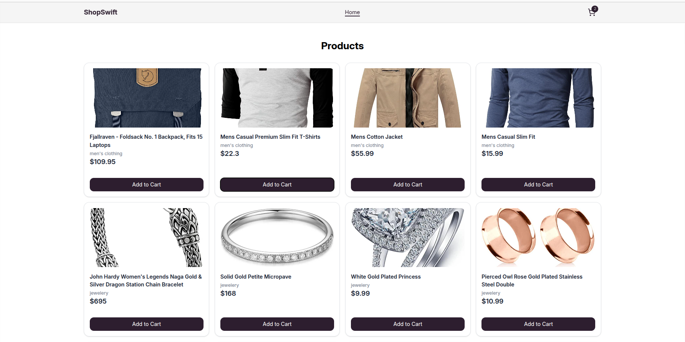
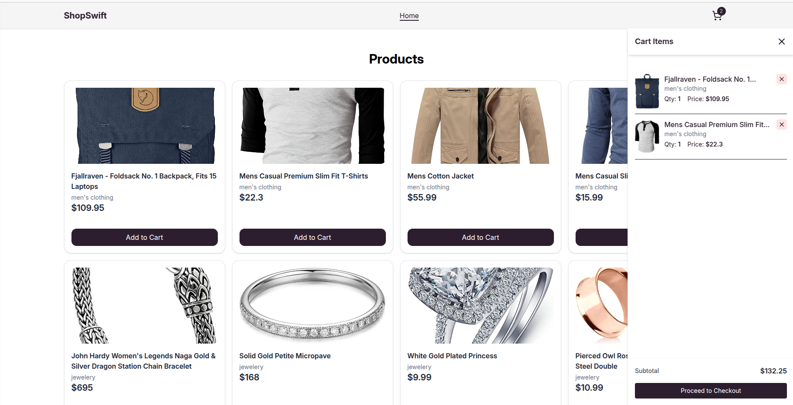
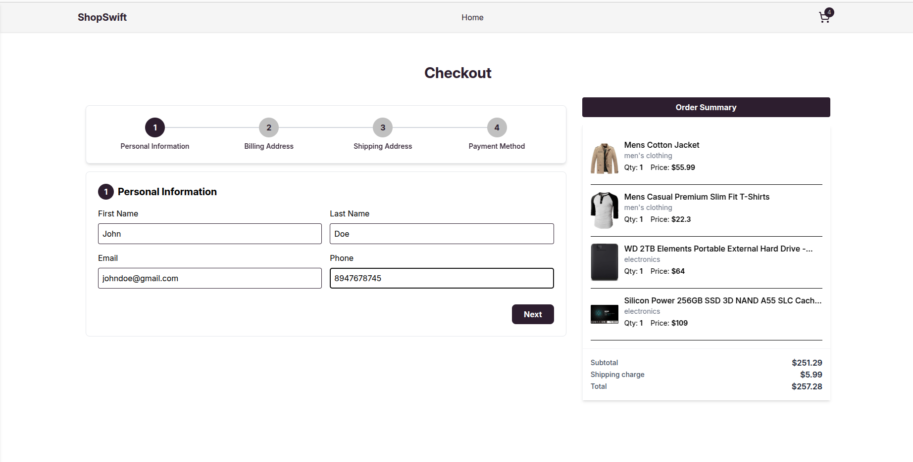

# 🛍️ ShopSwift – Modern E-commerce

A modern and responsive e-commerce web application built with **React**, **Redux Toolkit**, and **TypeScript**, offering seamless product browsing, cart management, and order placement experience.

---

## 🚀 Tech Stack

| Tech              | Description                               |
| ----------------- | ----------------------------------------- |
| **React**         | Frontend framework                        |
| **Redux Toolkit** | State management (cart, products, orders) |
| **TypeScript**    | Strongly typed JS                         |
| **Tailwind CSS**  | Utility-first UI styling                  |
| **FakeStoreAPI**  | Dummy product & category API              |
| **React Router**  | Navigation and routing                    |

---

## 🧩 Features

-   🛒 Product listing with images and categories
-   📦 Add to cart and remove from cart
-   🧾 Place order functionality
-   🔄 Fetches data from [FakeStoreAPI](https://fakestoreapi.com/)
-   📱 Responsive UI
-   🚀 Built using Redux Toolkit and TypeScript

---

## 📸 Screenshots

> Replace these URLs with actual hosted image links or local image paths

| Product Page | Cart Page |
| ------------ | --------- |

|  |
|  |

---
